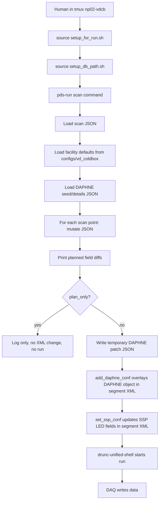

# VD coldbox DAQ scan guide

This guide explains the full path for running VD coldbox PDS calibration scans through the DAQ. It is written for someone who knows basic shell commands but has not yet used this work area.

## One-screen summary

Log in to the DAQ run host, attach to the `np02-vdcb` tmux session, source the DAQ environment, install the PDS checkout in that Python environment, run a plan-only scan, then only remove the safety flags when the plan is correct.

```bash
ssh -J marroyav@np04-srv-017 np04daq@np04-srv-024
tmux new -As np02-vdcb

cd /nfs/sw/dunedaq/dunedaq-fddaq-v5.5.0-dev-pds
source setup_for_run.sh
source ehn1-daqconfigs-ssp-only-20260310/setup_db_path.sh

source ~/bin/web_proxy.sh
python -m pip install wheel
python -m pip install -e pds-vdcb-daq-scans --no-deps --no-build-isolation
source ~/bin/web_proxy.sh -u

pds-run att-scan pds-vdcb-daq-scans/configs/vd_coldbox/09_vgain_led_scan_np02_ssp.json
pds-run afe-bias-scan pds-vdcb-daq-scans/configs/vd_coldbox/10_afe_bias_led_scan_np02_ssp.json
```

Detach from tmux with `Ctrl-b` then `d`. Reattach with:

```bash
tmux attach -t np02-vdcb
```

## Hosts and accounts

Use `np04daq` on `np04-srv-024` for DAQ runs. That account has the SSH access needed by the DAQ process manager to reach the readout hosts such as `np02-srv-001`.

The account `marroyav` on `np04-srv-017` is useful as the gateway. Do not run the DAQ process from `marroyav@np04-srv-017`; that path has failed at the process-manager SSH step.

Recommended one-hop login from your laptop:

```bash
ssh -J marroyav@np04-srv-017 np04daq@np04-srv-024
```

Equivalent two-hop login:

```bash
ssh marroyav@np04-srv-017
ssh np04daq@np04-srv-024
```

## Important paths

The active DAQ work area is:

```text
/nfs/sw/dunedaq/dunedaq-fddaq-v5.5.0-dev-pds
```

The PDS scan-development checkout is:

```text
/nfs/sw/dunedaq/dunedaq-fddaq-v5.5.0-dev-pds/pds-vdcb-daq-scans
```

The active VD coldbox DAQ configuration checkout is:

```text
/nfs/sw/dunedaq/dunedaq-fddaq-v5.5.0-dev-pds/ehn1-daqconfigs-ssp-only-20260310
```

The active segment XML that receives the DAPHNE and SSP updates is:

```text
/nfs/sw/dunedaq/dunedaq-fddaq-v5.5.0-dev-pds/ehn1-daqconfigs-ssp-only-20260310/segments/pds-vdcb.data.xml
```

The active session XML used by `drunc` is:

```text
/nfs/sw/dunedaq/dunedaq-fddaq-v5.5.0-dev-pds/ehn1-daqconfigs-ssp-only-20260310/sessions/pds-vdcb-session.data.xml
```

## What to source

Always start in tmux on `np04-srv-024`:

```bash
tmux new -As np02-vdcb
cd /nfs/sw/dunedaq/dunedaq-fddaq-v5.5.0-dev-pds
source setup_for_run.sh
source ehn1-daqconfigs-ssp-only-20260310/setup_db_path.sh
```

`setup_for_run.sh` sets the DAQ software environment and selects names from the tmux session. The session name must be `np02-vdcb`.

`setup_db_path.sh` puts the VD coldbox configuration checkout on the DAQ database path.

Check that the right PDS checkout is active:

```bash
python -c 'import pds; print(pds.__file__)'
pds-run --help | grep -E 'att-scan|afe-bias-scan'
```

The first command should print a path under:

```text
/nfs/sw/dunedaq/dunedaq-fddaq-v5.5.0-dev-pds/pds-vdcb-daq-scans/src/pds
```

## Python package install and web proxy

Use the web proxy only for package downloads. Disable it again before plan checks or DAQ runs.

```bash
source ~/bin/web_proxy.sh
python -m pip install wheel
python -m pip install -e pds-vdcb-daq-scans --no-deps --no-build-isolation
source ~/bin/web_proxy.sh -u
```

Use `python -m pip`, not a random `pip` from the shell, so the package goes into the DAQ-created Python environment from `setup_for_run.sh`.

After disabling the proxy, verify:

```bash
python -m pip show wheel pds-runner
python -c 'import pds; print(pds.__file__)'
pds-run --help | grep -E 'att-scan|afe-bias-scan'
```

## The whole chain



The short version:

```text
scan config JSON
  + facility defaults
  + DAPHNE seed/details JSON
        |
        v
PDS creates per-point JSON changes
        |
        v
add_daphne_conf overlays daphne_mezz in pds-vdcb.data.xml
        |
        v
set_ssp_conf overlays np02-ssp-on in pds-vdcb.data.xml
        |
        v
drunc-unified-shell runs pds-vdcb-pds with pds-vdcb-session.data.xml
```

## File roles

`configs/vd_coldbox/00_paths.json`

Defines where the DAQ work area and XML files live. For this setup it points at `ehn1-daqconfigs-ssp-only-20260310`, not the older `ehn1-daqconfigs`.

`configs/vd_coldbox/02_run_defaults.json`

Defines default run and SSP LED settings, such as `change_rate`, `wait_time`, `ssp_conf.object_name`, `channel_mask`, pulse width, and LED biases.

`configs/vd_coldbox/daphne_mezz.json`

The base DAPHNE details file for board-keyed VD coldbox configuration.

`configs/vd_coldbox/99_apply_fe_min_v2_subset.json`

A compact DAPHNE seed/details file for a subset of channels and AFEs. The sample scan configs use it so the plan is easy to inspect.

`configs/vd_coldbox/09_vgain_led_scan_np02_ssp.json`

Sample `vgain` scan. It changes `61.afes.attenuators` and then runs the LED/DAQ sequence for each scan point.

`configs/vd_coldbox/10_afe_bias_led_scan_np02_ssp.json`

Sample AFE bias scan. It changes `61.afes.v_biases`, fixes the non-scanned AFEs, and then runs the LED/DAQ sequence for each scan point.

## DAPHNE seed/details JSON

VD coldbox DAPHNE configuration is board-keyed. Board 61 looks like this:

```json
{
  "61": {
    "bias_ctrl": 1300,
    "channel_analog_conf": {
      "ids": [4, 5, 6, 7, 12, 13, 14, 15],
      "gains": [1, 1, 1, 1, 1, 1, 1, 1],
      "offsets": [2000, 2000, 2000, 2000, 2000, 2000, 2000, 2000],
      "trims": [0, 0, 0, 0, 0, 0, 0, 0]
    },
    "afes": {
      "ids": [0, 1],
      "attenuators": [1600, 1600],
      "v_biases": [1195, 916]
    }
  }
}
```

Useful fields:

- `afes.attenuators`: DAPHNE FE `vgain` DAC values.
- `afes.v_biases`: SiPM bias DAC values, one per AFE in `afes.ids`.
- `bias_ctrl`: DAPHNE bias controller DAC setting.
- `channel_analog_conf.offsets`: per-channel offset DAC values.
- `channel_analog_conf.trims`: per-channel trim values.
- `self_trigger_threshold`: self-trigger threshold, when present.

The length and order of each vector must match the matching `ids` list.

## Scan config structure

The sample `vgain` scan:

```json
{
  "mode": "attscan",
  "facility": "vd_coldbox",
  "daphne_obj": "daphne_mezz",
  "daphne_details": "pds/configs/vd_coldbox/99_apply_fe_min_v2_subset.json",
  "plan_only": true,
  "dry_run": true,
  "skip_dts": true,
  "scan": {
    "selectors": {
      "board_ids": ["61"],
      "afe_ids": [0, 1, 2, 3, 4]
    },
    "attenuators": {
      "min": 500,
      "max": 3000,
      "step": 250
    },
    "mask_values": [4],
    "led_intensities": {
      "values": [4095]
    }
  }
}
```

The sample AFE bias scan:

```json
{
  "mode": "afebiasscan",
  "facility": "vd_coldbox",
  "daphne_obj": "daphne_mezz",
  "daphne_details": "pds/configs/vd_coldbox/99_apply_fe_min_v2_subset.json",
  "plan_only": true,
  "dry_run": true,
  "skip_dts": true,
  "scan": {
    "selectors": {
      "board_ids": ["61"]
    },
    "afe_bias": {
      "ids": [0],
      "values": [1143, 1169, 1195],
      "fixed": {
        "1": 0,
        "2": 0,
        "3": 0,
        "4": 0
      },
      "bias_ctrl": 1300
    },
    "mask_values": [4],
    "led_intensities": {
      "values": [4095]
    }
  }
}
```

Selector meanings:

- `board_ids`: only change those DAPHNE boards. For the current VD coldbox path, use `["61"]`.
- `afe_ids`: only change those AFEs for attenuator scans.
- `channel_ids`: only change those DAPHNE channels for offset and trim scans.
- `afe_bias.ids`: AFEs whose bias is scanned.
- `afe_bias.fixed`: AFEs that should be forced to a fixed bias value while another AFE is scanned.

## Safety flags

Start every new scan with:

```json
{
  "plan_only": true,
  "dry_run": true,
  "skip_dts": true
}
```

`plan_only: true` is the main safety switch. It prints planned DAPHNE, SSP, and `drunc` actions without changing XML and without taking data.

`dry_run: true` prevents the final `drunc` command from running, but by itself it does not protect the XML update. Keep `plan_only: true` until the printed diff is exactly what you expect.

`skip_dts: true` skips DTS Butler setup. Keep it true for plan checks. Decide explicitly before a real DAQ run.

## Plan-only checks

Run these first:

```bash
pds-run att-scan pds-vdcb-daq-scans/configs/vd_coldbox/09_vgain_led_scan_np02_ssp.json
pds-run afe-bias-scan pds-vdcb-daq-scans/configs/vd_coldbox/10_afe_bias_led_scan_np02_ssp.json
```

A good plan-only log shows lines like:

```text
Planned DAPHNE changes for attenuators:
  61.afes.attenuators: [1600, 1600] -> [500, 500]
plan_only=True; skipping DAPHNE update.
plan_only=True; would set SSP mask=4 bias=4095 and run drunc.
plan_only=True; would run drunc command: ...
```

For AFE bias:

```text
Planned DAPHNE changes for AFE bias:
  61.afes.v_biases: [1195, 916] -> [1143, 0]
plan_only=True; skipping DAPHNE update.
```

If the diff changes the wrong board, channel, AFE, or field, stop and fix the JSON before running for real.

## Creating a real scan config

Do not edit the sample configs for a one-off run. Copy or generate a temporary config and keep the samples as references.

Example: make a one-point `vgain` check config in `/tmp`:

```bash
pds-run conf-update \
  --conf pds-vdcb-daq-scans/configs/vd_coldbox/09_vgain_led_scan_np02_ssp.json \
  --output /tmp/vdcb_one_point_vgain.json \
  --no-backup \
  --set plan_only=false \
  --set dry_run=false \
  --set scan.attenuators.min=1600 \
  --set scan.attenuators.max=1600 \
  --set scan.attenuators.step=1 \
  --set wait_time=10
```

Then inspect it:

```bash
python -m json.tool /tmp/vdcb_one_point_vgain.json | less
```

Run only when the config is correct:

```bash
pds-run att-scan /tmp/vdcb_one_point_vgain.json
```

## What happens in execute mode

For each scan point:

1. PDS loads the DAPHNE seed/details JSON.
2. PDS mutates only the requested field, for example `61.afes.attenuators`.
3. PDS prints a field-level diff.
4. PDS writes a temporary board-keyed JSON patch.
5. PDS runs:

```bash
add_daphne_conf <segment_xml> <temporary_patch_json> -n daphne_mezz -t 5000
```

6. PDS runs `set_ssp_conf` on the same segment XML using `ssp_conf` plus scan overrides:

```bash
set_ssp_conf <segment_xml> --object-name np02-ssp-on ...
```

7. PDS runs:

```bash
drunc-unified-shell ssh-CERN-kafka.json \
  <session_xml> np02-session pds-vdcb-pds \
  start-run --run-type <run_type> \
  change-rate --trigger-rate <change_rate> \
  wait <wait_time> \
  shutdown terminate
```

## Troubleshooting

`error: invalid command 'bdist_wheel'`

Install `wheel` inside the sourced DAQ Python environment:

```bash
source ~/bin/web_proxy.sh
python -m pip install wheel
python -m pip install -e pds-vdcb-daq-scans --no-deps --no-build-isolation
source ~/bin/web_proxy.sh -u
```

If `pip` reports `Network is unreachable`, the proxy was not enabled before the install.

`FileNotFoundError: .../ehn1-daqconfigs/segments/pds-vdcb.data.xml`

The config is pointing at the old DB folder. Use `ehn1-daqconfigs-ssp-only-20260310` in `configs/vd_coldbox/00_paths.json`, then source:

```bash
source ehn1-daqconfigs-ssp-only-20260310/setup_db_path.sh
```

`Permission denied` for `np02-srv-001`

You are probably not running as `np04daq@np04-srv-024`. Log in to the DAQ run host and run from the `np04daq` account.

`pds-run --help` does not show `afe-bias-scan`

The DAQ Python environment is not using the scan-development checkout. Re-source the environment and reinstall:

```bash
cd /nfs/sw/dunedaq/dunedaq-fddaq-v5.5.0-dev-pds
source setup_for_run.sh
source ehn1-daqconfigs-ssp-only-20260310/setup_db_path.sh
source ~/bin/web_proxy.sh
python -m pip install wheel
python -m pip install -e pds-vdcb-daq-scans --no-deps --no-build-isolation
source ~/bin/web_proxy.sh -u
pds-run --help | grep afe-bias-scan
```

## Minimal checklist before data taking

1. You are in tmux session `np02-vdcb`.
2. You are on `np04daq@np04-srv-024`.
3. `setup_for_run.sh` has been sourced.
4. `ehn1-daqconfigs-ssp-only-20260310/setup_db_path.sh` has been sourced.
5. `python -c 'import pds; print(pds.__file__)'` points at `pds-vdcb-daq-scans`.
6. `pds-run --help` shows the scan command you need.
7. The config has been run once with `plan_only: true`.
8. The printed DAPHNE diff touches only the expected board and field.
9. The run config has the intended `wait_time`, `change_rate`, `run_type`, LED mask, and LED intensity.
10. Only then set `plan_only: false` for a real run.
